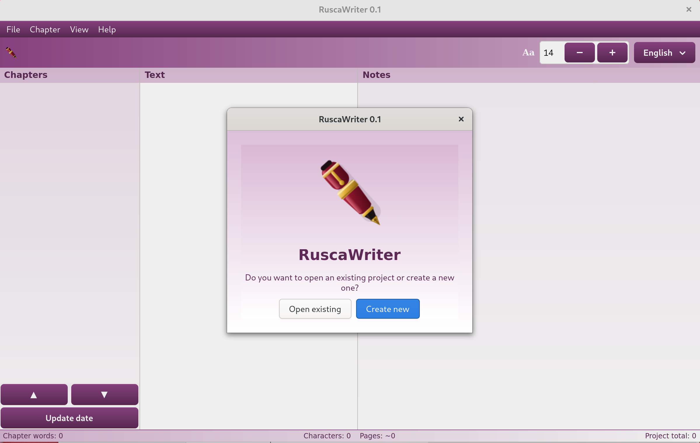

# RuscaWriter

*Un editor di scrittura a tre colonne per la saggistica — parte del progetto [RuscaLinux](https://www.ruscalinux.org/).*

🇬🇧 [Read it in English](README.md)

[](LICENSE)
[](https://www.ruscalinux.org/ruscawriter/)
[](https://ko-fi.com/ruscalinuxdev)



Capitoli, testo e note affiancati. Scrivi in Markdown semplice ed esporta un
libro finito — senza plugin né convertitori esterni.

## Caratteristiche

- **Tre colonne**: elenco capitoli, testo e note del capitolo in un'unica vista
- **Esportazione** in PDF (impaginato, font incorporati, indice automatico), EPUB, DOCX, ODT, HTML, Markdown, TXT
- **Frontespizio e colophon** generati da semplici campi editoriali
- **Correttore ortografico** che gestisce le elisioni italiane e francesi (*dell'anima*, *l'uomo*)
- **Interfaccia in 40 lingue**, tema prugna chiaro e scuro
- **Progetti in testo semplice**: un file `.rwr` è solo un tar.gz di Markdown — tuo per sempre

## Installazione e avvio

Richiede Python 3, PyGObject e GTK 4. Su Debian / Ubuntu / RuscaLinux:

```bash
sudo apt install python3-gi gir1.2-gtk-4.0
# facoltativo, per il correttore ortografico:
sudo apt install gir1.2-gtksource-5 gir1.2-spelling-1 hunspell-it hunspell-en-us
```

Avvio dal sorgente:

```bash
python3 ruscawriter.py
```

Oppure scarica il pacchetto `.deb` dalla pagina [Releases](https://github.com/ruscalinux-dev/ruscawriter/releases).

## Collegamenti

- 🏠 **Sito**: <https://www.ruscalinux.org/ruscawriter/>
- ☕ **Sostieni il progetto**: <https://ko-fi.com/ruscalinuxdev>

## Contribuire

Segnalazioni, traduzioni e pull request sono benvenute — vedi
[CONTRIBUTING.md](CONTRIBUTING.md). Esegui i test con
`python3 tests/test_ruscawriter.py`.

## Licenza

Software libero sotto **GNU GPL v3 o successiva** — vedi [LICENSE](LICENSE).
I font inclusi (EB Garamond, Courier Prime) sono sotto SIL Open Font
License 1.1 (testi in `assets/`).
