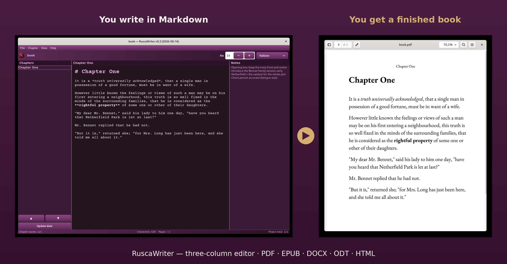

# RuscaWriter

🇮🇹 [Leggilo in italiano](README.it.md)



Three-column writing editor (chapters · text · notes) from the **RuscaLinux**
project. Designed for texts and general non-fiction, with export to many
formats and an interface in 40 languages. Free software under the GNU
GPL v3+ licence.

## Running

From the project folder:

```
python3 ruscawriter.py
```

Requirements: Python 3, PyGObject and GTK 4. On Debian/Ubuntu:

```
sudo apt install python3-gi gir1.2-gtk-4.0
```

For spell checking (optional but recommended), GTK 4 needs **libspelling**
(the same library used by GNOME Text Editor); Gspell 1.x and GtkSpell do NOT
work with GTK 4 because they are tied to GTK 3:

```
sudo apt install gir1.2-spelling-1 gir1.2-gtksource-5 hunspell-it hunspell-en-us
```

libspelling operates on a `GtkSource.View` editor, so **GtkSourceView 5**
(`gir1.2-gtksource-5`) is also required: if present, the writing area uses it
automatically; if missing, the editor still works but without spell checking.

**Elision (it/fr).** GTK 4 spell checking (libspelling/ICU) splits words on the
apostrophe, so forms such as *dell'anima* or *l'uomo* would be flagged as
errors (the fragment *dell*, *l*, etc. is not a word). To avoid this, on startup
RuscaWriter automatically adds the elision fragments for Italian and French to
the personal Enchant word lists in `~/.config/enchant/<locale>.dic`, without
touching the words you have added yourself. It is transparent: you don't have to
do anything.

Add the `hunspell-<language>` packages for the languages you need
(e.g. `hunspell-fr`, `hunspell-de`): the editor will automatically show in the
selector the languages for which a dictionary is installed.

## Project structure

```
ruscawriter/
├── ruscawriter.py            application launcher
├── ruscawriter.desktop       entry for the GNOME applications menu
├── README.md
├── src/ruscawriter/          source code (Python package)
│   ├── __init__.py          exposes main()
│   ├── editor.py            GTK 4 graphical interface
│   ├── model.py             data model and export (GTK-independent)
│   ├── i18n.py              translations and languages
│   └── paths.py             locates the lang/ and assets/ folders
├── lang/                    40 translation files (.json)
├── assets/                  CourierPrime font and icons
│   └── icons/hicolor/        icon in every size (16…512 px + SVG)
├── install-icons.sh         installs the icons into the system theme
├── tests/                   automated tests
│   └── test_ruscawriter.py
└── docs/                    learning material
    ├── GUIDA_DIDATTICA.md
    └── mini_ruscawriter.py
```

## Tests

```
python3 tests/test_ruscawriter.py
```

## Icon in the applications menu

The icon (the burgundy-and-gold fountain pen) is provided as a scalable SVG and
as PNG in every standard size (16, 22, 24, 32, 48, 64, 128, 256, 512 px), in the
`assets/icons/hicolor/` structure. To install it into the system, so it appears
next to the program in the menu and dock:

```
sh install-icons.sh
```

Then copy `ruscawriter.desktop` into `~/.local/share/applications/` (the file
uses `Icon=ruscawriter`, which the system will resolve with the icon you just
installed).

## Languages

The interface is available in 40 languages, switchable on the fly from
**View → Language**. Seven languages are fully translated: Italian, English,
Spanish, French, German, Portuguese and Russian. The other languages start as
"skeletons" that fall back to English: in the menu they are grouped in a
separate section and marked as "not translated", making it clear that the
interface will stay in English until they are completed. To translate one, just
edit the corresponding file in `lang/` (and, if you like, add its code to
`COMPLETE_LANGUAGES` in `src/ruscawriter/i18n.py`) — without touching the rest
of the code.

**Editorial sections.** From **File → Editorial sections…** you can add a cover
image (PNG or JPEG), a frontispiece and a colophon. They are laid out together
with the text in the order cover → frontispiece → chapters → colophon. The cover
image appears in PDF, EPUB, HTML, DOCX and ODT (in the other formats, and in
TXT/Markdown, only the textual sections remain); if you don't load an image, the
generated graphic cover is used. Everything is embedded in the `.rwr` file,
which stays self-contained.

**Importing text as chapters.** From **File → Import as chapters…** (or
`Ctrl+I`) you can choose one or more `.txt`/`.md` files: each is added as a new
chapter at the end of the current project (one file = one chapter), without
touching the other chapters. The same effect is achieved by **dragging** the
files onto the writing area. The chapter title is taken from the file name.

## Export formats

TXT, Markdown, PDF, EPUB, ODT, DOCX, HTML (single file or multi-file with index)
and AZW3 (Kindle, via Calibre if installed). PDF, EPUB, ODT and DOCX are
generated with no external dependencies, using only the Python standard library.

**Fonts.** The editor uses Courier Prime (monospace, typewriter style) for
writing. Exported documents instead use a serif reading face, **EB Garamond**,
better suited to a book: in the PDF the font is embedded (with the real widths
of each glyph, since it is a proportional font), while EPUB and HTML request it
by name with a fallback to system serifs. Both fonts are free, released under
the **SIL Open Font License 1.1**, and their licence texts are in `assets/`
next to the `.ttf` files.

## Keyboard shortcuts

The main functions have a shortcut, useful especially in full screen (F11),
where drop-down menus may fail to open due to known limitations of GTK popovers
with some window managers:

- `Ctrl+N` new, `Ctrl+O` open, `Ctrl+S` save, `Ctrl+I` import as chapters
- `Ctrl+Shift+N` add chapter, `F2` rename chapter
- `Ctrl+F` find and replace
- `Ctrl++` / `Ctrl+-` increase/decrease text size
- `Ctrl+E` preview, `Ctrl+Shift+E` preview whole document
- `Ctrl+L` / `Ctrl+R` show/hide chapters/notes column
- `F11` full screen
- `Ctrl+Shift+D` dark theme
- `F1` About

## How it was made

RuscaWriter was designed and directed by the RuscaLinux project: the concept,
the three-column layout, the visual design and interface, the light and dark
plum theme, the feature set, the export pipeline and the editorial decisions
are all human work. The Python implementation was then produced with the help
of AI tools, working from detailed step-by-step direction, and reviewed and
tested by a human at every stage.

We mention this openly because we think it's the honest way to describe how
the software was built — a human deciding what to make, how it should look and
how it should work, and AI used as a tool to write the code.

## Contributing

Contributions are welcome: bug reports, translations, fixes and new features.
See [CONTRIBUTING.md](CONTRIBUTING.md) for how to report an issue, run the tests
and propose a change.

## Licence

Copyright © 2026 Nunzio Curcuruto.

RuscaWriter is free software released under the **GNU General Public License
v3 or later (GPL-3.0-or-later)**. The full text is in the [LICENSE](LICENSE)
file.

RuscaWriter was designed, including its visual design and interface, and
directed by the RuscaLinux project. The Python implementation was produced
with AI tools following detailed, step-by-step human direction, review, and
testing.

The included fonts (EB Garamond, Courier Prime) are released under the **SIL
Open Font License 1.1**; their texts are in `assets/`.
